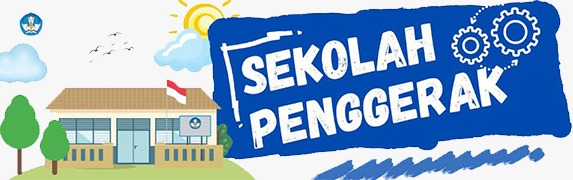

# Project

<div align="center">
  <p>
    <a href="#"></a>
  </p>
  <p>
    <a href="#"></a>
    <a href="#"></a>
  </p>
</div>


Tema : Perbedaan 
Opening => Wawancara => Orasi 

Durasi total 5 - 15 menit
Audio terpisah pake mic clip on
Upload ke google drive (nanti dikasi)
Visual :
    (min)30 fps
    Rasio 9:16
    Resolusi (min) 1920x1080
## Isi

Wawancara :
```
pertanyaan:
    Nama
    Asal daerah, suku, pernah tinggal di..
    Pendapat tentang toleransi, keberagaman, / persatuan
    Pesan, harapan, kesan, utk Indonesia (bahasa daerah)
    jangan lupa nanya artinya nanti dimasukin ke sub
    Pesan untuk generasi muda
    Suruh bacain 1 baris orasi
```


Nanti format editnya tiap jawaban pertanyaan kita satuin dulu, baru lanjut ke pertanyaan lain, tiap ganti pertanyaan, pertanyaan dari kitanya dimasukin. Kalo suaranya kecil krn clip onnya dipegang dia, tgl kita take ulang pertanyaannya

Kalo resolusi atau fps nya ada yg lebih tinggi nanti tgl di compress biar sama, kalo masalah lighting sebisa mungkin diatur pas nge record, kasian kalo dibebanin ke editor

Abis mereka bacain orasi, langsung kita samber make orasi dari kitanya, tapi karena kitanya ga onscreen, jadi kita mesti ngumpulin footage lain, bisa video mereka yg di slowmo, atau ngambil dari google foto2 org make baju daerah.
Nah, selama orasi backsoun lagu wajibnya dikencengin biar tambah dramatis, wkwkwk


<div align="center">
    
</div>
