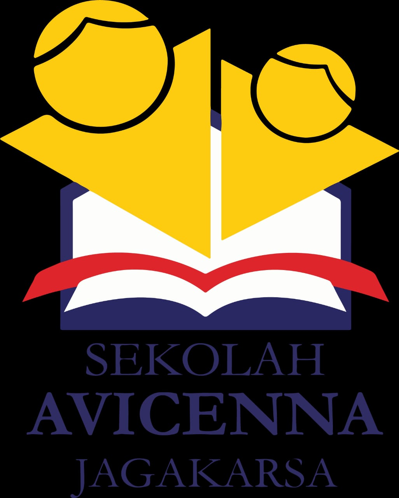

# Project

<div align="center">
  <p>
    <a href="#"></a>
  </p>
  <p>
    <a href="#"></a>
    <a href="#"></a>
  </p>
</div>

<!-- this is table of content -->
<details>
  <summary>Daftar Isi</summary>
  <ol>
    <li>
      <a href="#project">Project</a>
      <ul>
        <li><a href="#perlengkapan">Perlengkapan</a></li>
      </ul>
    </li>
    <li>
      <a href="#isi">Isi</a>
      <ul>
        <li><a href="#wawancara">Wawancara</a></li>
        <li><a href="#orasi">Orasi</a></li>
      </ul> 
    </li>  
    <li>
      <a href="#pr">PR</a>
    </li>
  </ol>
</details>

Kelompok 7
Pembimbing : Meta Saputra

Anggota :
```
    1. Muhammad Fikri
    2. Adine Rahma julia
    3. Adrien Rafarrel Nararya Wardhana
    4. Anindita Nazwa Kencana Dewantoro
    5. Cut Almitra Asiyah
    6. Dimas Bahiy
    7. Maulana Azka Masykur
    8. Pradavi Syafira
    9. Rafa Damartya
```

> Tema : Perbedaan

Gambaran Umum : Opening => Wawancara => Orasi 

<p>
  <a href="#"></a>
  <a href="#"></a>
</p>

```
Durasi total 5 - 15 menit
Audio terpisah pake mic clip on
Upload ke google drive (nanti dikasi)
Visual :
    (min)30 fps
    Rasio 9:16
    Resolusi (min) 1920x1080
```

1. Opening Projek => Bisa perkenalan diri atau berisi dokumenter

2. Isi Video Projek => Wawancara dan Orasi

### Perlengkapan

+ Kamera (hp, kamera, dan sebagainya)
+ Tripod
+ Ringlight (jika ada)
+ Mic
+ Dan sebagainya

<br>

## Isi

### Wawancara

+ Nama : 
+ Asal daerah, suku, pernah tinggal di...
+ Pendapat tentang toleransi, keberagaman / persatuan :
+ Pesan, harapan, kesan untuk Indonesia (dalam bahasa daerah) => (subtitle)
+ Pesan untuk generasi muda : 

### Orasi 

Orasi tidak on screen (dokumenter)

+ Video sektiar 2-3 menit
+ Diiringi lagu daerah

#### Naskah orasi (rancangan)

```
Negara Kesatuan republik Indonesia
Negara yang dilewati garis khatulistiwa
Negara kepulauan dengan laut yang mempersatukan
Negara agraris dengan sumber daya alam yang melimpah

Pulau-pulau yang berjajar 
Dari Sabang sampai Marauke
Sambung menyambung menjadi satu kesatuan
Itulah kita, Indonesia

Merah putih warna bendera ku
Pancasila lambang negara ku
Bhinneka tunggal ika semboyan ku
“Walaupun berbeda-beda tetapi tetaplah satu” Itulah kita

Bangsa Indonesia, bangsa yang penuh keanekaragaman
Perbedaan suku, ras, agama, antargolongan, budaya, Bahasa, dan lainnya
Tidak menghalangi kita dalam mewujudkan cita-cita bangsa kita
Menjadi bangsa yang adil, makmur, dan sejahtera

Perbedaan bukanlah alasan kita untuk saling menjauhi
Bukanlah alasan kita untuk mendiskriminasi
Bukanlah alasan kita untuk terpecah belah
Namun, menyatukan kita semua yang berasal dari latar belakang yang berbeda-beda

Bangsa Indonesia, tidaklah mengenali perbedaan
Tetapi, Bangsa Indonesia hanya mengenali persatuan
Kata-kata Merdeka! Merdeka! Dan Merdeka!
Tidaklah akan terucap
Tanpa adanya rasa persatuan di dalam diri

Pupuklah rasa solidaritas
Tanamkan rasa kebersamaan
Syukuri setiap perbedaan
Karena kita adalah Indonesia
```

**Bersatu kita teguh, bercerai kita runtuh** => bersama sama

<br>


### Teknis

```
Nanti format editnya tiap jawaban pertanyaan kita satuin dulu, baru lanjut ke pertanyaan lain, tiap ganti pertanyaan, pertanyaan dari kitanya dimasukin. Kalo suaranya kecil krn clip onnya dipegang dia, tgl kita take ulang pertanyaannya

Kalo resolusi atau fps nya ada yg lebih tinggi nanti tgl di compress biar sama, kalo masalah lighting sebisa mungkin diatur pas nge record, kasian kalo dibebanin ke editor

Abis mereka bacain orasi, langsung kita samber make orasi dari kitanya, tapi karena kitanya ga onscreen, jadi kita mesti ngumpulin footage lain, bisa video mereka yg di slowmo, atau ngambil dari google foto2 org make baju daerah.
Nah, selama orasi backsoun lagu wajibnya dikencengin biar tambah dramatis, wkwkwk

Intro => Putih, logo avi, lim, sekolah penggerak

Narasi Opening
Audio : Narasi awal buat basa basi sblm lanjut ke wawancara, misal, "Indonesia adalah negara..., Keberagaman merupakan hal yang shrsnya kita... Maka, kami memutuskan untuk mewawancarai... Agar dapat mengenal lebih dalam... Dimulai dari lingkungan sekolah..."
Visual : Footage sekolah, footage pas kita lagi jalan, / masyarakat sekitar
BGM : https://www.youtube.com/watch?v=DFEUckKgjXU (Free Backsound Gamelan)

Wawancara
BGM : https://youtu.be/aZFECPabyvg (Beautiful Indonesia)
Vid : 
Kalo bisa tiap pertanyaan, pertanyaannya cukup 1 diawal (biar ga tiap org pertnya diulang")
Urutannya nama, asal, pesan, b daerah
Bahasa daerah pake subtitle (arti + b daerahnya)

Bridging
Layar ngegelap, musik fadeout, gelap total kurleb 2 detik (seakan" mau udahan), pas gelap mulai nyala BGM Orasinya

Orasi
Orasinya sendiri (ada versi yg udah di cut kalo mau ngasi jarak)
BGM : https://www.youtube.com/watch?v=4dUrCTzKi7s (Framelens Audiovisual)
Vid : Vid / foto "keragaman" yg uda kita ambil dari yt + google
Pas "brst kt tgh brcrai kt rnth" sebisa mungkin dipasin sama suara BS biar enak nge cutnya

Credit / Penutup
Layar ngegelap sampe item, make BS intro lagi, kasi nama anggota + pembina, sumber vid / foto yg ngambil
```


## PR

1. Target wawancara [✔️]
   1. Berapa orang => 3 orang
   2. Siapa aja => Pak Rizal, Pak Iwan, Pak Bintana
2. Bagi bagi kalimat orasi [✔️]
3. Editing []
4. Cari backsound buat scene orasi []
   1. Backsound pas opening
   2. backsound pas wawancara
   3. Backsound pas orasi

<br><br><br>

<div align="center">
    <p></p>
    <p></p>
</div>
